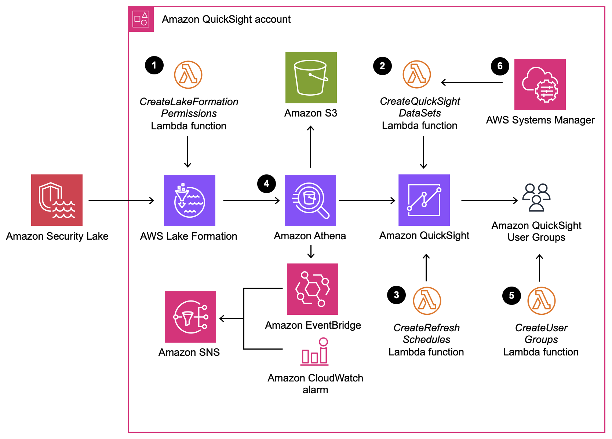

⚠️🚨⚠️ Security Insights on AWS is no longer available. We encourage customers to explore using Amazon Security Lake to centralize, normalize, and analyze their security data across AWS, on-premises, and third-party sources. ⚠️🚨⚠️

*[🚀 Solution Landing Page](https://aws.amazon.com/solutions/implementations/security-insights-on-aws/)** | **[🚧 Feature request](https://github.com/aws-solutions/security-insights-on-aws/issues/new?assignees=&labels=feature-request%2C+enhancement&template=feature_request.md&title=)** | **[🐛 Bug Report](https://github.com/aws-solutions/security-insights-on-aws/issues/new?assignees=&labels=bug%2C+triage&template=bug_report.md&title=)**

Note: If you want to use the solution without building from the source, navigate to the Security Insights on AWS solution [landing page](https://aws.amazon.com/solutions/implementations/security-insights-on-aws/) to download the AWS CloudFormation template..

## Table of contents

- [Solution overview](#solution-overview)
- [Architecture overview](#architecture-overview)
- [Prerequisites](#prerequisites)
- [Installation](#installation)
- [Customizing the solution](#customizing-the-solution)
  - [Build](#build)
  - [Unit test](#unit-test)
  - [Deploy](#deploy)
    - [CloudFormation deploy](#cloudformation-deploy)
    - [CDK deploy](#cdk-deploy)
- [File structure](#file-structure)
- [Collection of operational metrics](#collection-of-operational-metrics)
- [License](#license)

# Solution overview
The Security Insights on AWS solution helps analyze the data within your Amazon Security Lake. Security Lake is a data lake service that's designed to collect security-related logs and events. It automatically centralizes security data from AWS environments, software as a service (SaaS) providers, and on-premises and cloud sources into a purpose-built data lake stored in your AWS account. This solution provides a single-pane view for your security data by creating an automated Amazon QuickSight dashboard. The dashboard’s pre-built widgets show critical insights for data sources such as: Amazon VPC Flow Logs, AWS CloudTrail management events, AWS Security Hub findings, and AWS AppFabric audit log data.


# Architecture overview

## Architecture reference diagram
The default deployment of solution pre-packaged template deploys following infrastructure in your account.




The high-level process flow for the solution components deployed with the AWS CloudFormation template is as follows:
1. **Create permissions** – The solution sets up the permissions needed to visualize the data from your Security Lake. As part of this setup, the solution: (a) Adds the AWS Identity and Access Management (IAM) role for the `CreateLakeFormationPermissions` AWS Lambda function as one of the admins for the Security Lake, and (b) Grants `Describe` and `Select` permissions on the Security Lake database and AWS Lake Formation data tables to the following principals:
- Service-linked role for QuickSight
- QuickSight admin user provided in the input parameters to the solution’s AWS CloudFormation template
- QuickSight user groups created by the solution
2. **Create datasets** – The solution provisions QuickSight datasets that are required for the QuickSight widgets.
3. **Create refresh schedules** – The solution provisions the QuickSight datasets with the refresh schedule provided as an input to the solution’s CloudFormation template.
4. **Create Athena workgroup** – The solution creates an Amazon Athena workgroup and runs all the queries for the QuickSight datasets as part of this workgroup. The solution also creates a CloudWatch alarm for this workgroup. You can set this threshold when deploying the solution’s CloudFormation template. If the solution exceeds the threshold, the CloudWatch alarm invokes an action to send an Amazon SNS notification to the provided email address.
5. **Manage QuickSight users** – The solution provisions three QuickSight user groups with read, write, and admin permissions. You can use these groups to give different levels of access to the QuickSight analysis and dashboards.
6. **AWS Systems Manager parameters to configure QuickSight dashboards** – After launching the solution, you must enable the data sources for which you want to see the insights in QuickSight analysis.

# Prerequisites
Before deploying this solution, set up your Security Lake and QuickSight admin account. For full instructions, see the [implementation guide](https://docs.aws.amazon.com/solutions/latest/security-insights-on-aws/prerequisites.html).

# Installation

If you plan to deploy the pre-packaged solution [template](https://solutions-reference.s3.amazonaws.com/security-insights-on-aws/latest/security-insights-on-aws.template), see the [implementation guide](https://docs.aws.amazon.com/solutions/latest/security-insights-on-aws/deploy-the-solution.html) for this solution.

# Customizing the solution

## Prerequisites for Customization

- [AWS Command Line Interface](https://aws.amazon.com/cli/)
- NodeJS 20

## Build

Building from the GitHub source allows you to modify the solution, such as adding custom actions or upgrading to a new release. The process consists of downloading the source from GitHub, creating Amazon S3 buckets to store artifacts for deployment, building the solution, and uploading the artifacts to Amazon S3 in your account.

#### 1. Clone the repository

Clone or download the repository to a local directory and make desired changes.

***Note:** If you intend to modify the source code, we recommend creating your own fork of the GitHub repo and working from that. This allows you to check in any changes you make to your private copy of the solution.*


**Git Clone example:**

```
git clone https://github.com/aws-solutions/security-insights-on-aws.git
```

## Unit test

Next, run unit tests to ensure that your customized code passes the tests:

```
cd <rootDir>/deployment
chmod +x ./run-unit-tests.sh
./run-unit-tests.sh
```

#### 3. Create S3 buckets for storing deployment assets

AWS Solutions use two buckets:

- One global S3 bucket that is accessed through the HTTP endpoint. CloudFormation templates are stored here. Example bucket name: `mybucket`.
- One regional bucket for each AWS Region where you plan to deploy the solution. Use the name of the global bucket as the prefix of the bucket name, and use the Region name as the suffix. Regional assets such as Lambda code are stored here. Example bucket name: `mybucket-us-east-1`.
- Inside this bucket, create a folder named with the same solution name specified in the next section.
- Inside that folder, create another folder named with the same version number specified in the next section. Example folder/prefix: `security-insights-on-aws/V1.0.0`.
- The assets in buckets must be accessible by your account.

#### 4. Declare environment variables

```
export CF_TEMPLATE_BUCKET_NAME=<YOUR_CF_TEMPLATE_BUCKET_NAME> # Bucket name for CFN templates
export DIST_OUTPUT_BUCKET=<YOUR_DIST_OUTPUT_BUCKET> # Bucket name for regional code assets without region suffix {example:'mybucket'}
export SOLUTION_NAME="security-insights-on-aws" # name of the solution
export VERSION=<VERSION> # version number for the customized solution
export QUICKSIGHT_TEMPLATE_ACCOUNT = <YOUR_QUICKSIGHT_TEMPLATE_ACCOUNT> # The AWS account from which the Amazon QuickSight templates should be sourced for Amazon QuickSight Analysis and Dashboard creation. If your Quicksight account does not have any analysis created, use Account ID provided in landing page template which had analysis created already.
export DIST_QUICKSIGHT_NAMESPACE = <YOUR_DIST_QUICKSIGHT_NAMESPACE> # The namespace in QuickSight account. Ex. "default". If you are using Account ID provided in landing page template provide 'solutions' as <YOUR_DIST_QUICKSIGHT_NAMESPACE>. 
```

#### 5. Build the solution

```
cd <rootDir>/deployment
chmod +x build-s3-dist.sh
./build-s3-dist.sh $CF_TEMPLATE_BUCKET_NAME $DIST_OUTPUT_BUCKET $SOLUTION_NAME $VERSION $QUICKSIGHT_TEMPLATE_ACCOUNT $DIST_QUICKSIGHT_NAMESPACE
```

## Upload Deployment Assets

## Upload deployment assets

- Copy the CloudFormation templates (`.template` files) from the directory `./deployment/
  global-s3-assets` into the global S3 bucket with the name referenced to `$CF_TEMPLATE_BUCKET_NAME`.
- Copy the Lambda distribution files (`.zip` files) from the directory `./deployment/
  regional-s3-assets` into the folder/prefix `$SOLUTION_NAME/$VERSION` in the regional S3 bucket with the name referenced to `$DIST_OUTPUT_BUCKET' is the specific AWS Region where you’re deploying the solution.

## Custom QuickSight Template

If you want to use your own QuickSight template as part of customization, update the datasets to match your QuickSight template. See [CreateTemplate](https://docs.aws.amazon.com/quicksight/latest/developerguide/create-template.html) in the *Amazon QuickSight Developer Guide* to understand more about QuickSight template creation. Your custom QuickSight template should have permissions that allow the deployment account to access the template. For more information about updating the QuickSight template permissions, see [UpdateTemplatePermissions](https://docs.aws.amazon.com/quicksight/latest/developerguide/update-template-permissions.html) in the *Amazon QuickSight Developer Guide*. You must also update the source entity used for creating QuickSight analysis and dashboards to match the new datasets.

## Deploy

## CloudFormation deploy

- From your designated S3 bucket where you uploaded the deployment assets, copy the link location for the `security-insights-on-aws.template` file.
- Using CloudFormation, launch the Security Insights for AWS solution stack using the copied Amazon S3 link for the `security-insights-on-aws.template` file.

## CDK deploy

If your accounts haven’t been bootstrapped for CDK yet, follow the (Bootstrapping)[https://docs.aws.amazon.com/cdk/v2/guide/bootstrapping.html] steps in the *AWS CDK v2 Developer Guide* to boostrap your account.

Determine the parameter values that you want to deploy the stacks with:

- **QuickSightUserNameArn:** Amazon Resource Name (ARN) for the QuickSight username that will be the admin for this deployment
- **SecurityLakeAccountId: ** Account ID in which the Security Lake is created
- **Frequency: ** Frequency for dataset refresh
- **WeeklyRefreshDay: ** Day for the weekly refresh of the dataset; select this option only if the Frequency is Weekly
- **MonthlyRefreshDay: ** Day for the monthly refresh of the dataset; select this option only if the Frequency is Monthly
- **EmailID: ** Email ID to receive the QuickSight dataset alerts
- **LogLevel: ** Log level for Lambda functions
- **ThresholdValueForAthenaAlarm: ** Threshold value in GB for Athena alarm
- **ThresholdUnitForAthenaAlarm: ** Unit for threshold value for Athena alarm

```
cd ./source/resources
npm run bootstrap -- --profile <PROFILE>
```

After identifying the values for the previous parameters, update the 'deploy' script in the `package.json` file located in the `source/resources` folder with the values for the input parameters. Update the `DIST_OUTPUT_BUCKET` name in the script to match the S3 bucket name used in the previous step. After updating the script, run the following commands. This deploys the stack with default parameters.

```
cd ./source/resources
npm run deploy 
```

To provide all the input parameters to the stack, update the script `deploy-with-parameters` in the `package.json` file located in the `source/resources` folder by providing all the input parameters. Update the `DIST_OUTPUT_BUCKET` name in the script to match the S3 bucket name used in the previous step. After updating the script, run the following commands.

```
cd ./source/resources
npm run deployWithParameters
```

# File structure

```
├── deployment                                    [Build scripts]
└── source                                        [This contains CDK App and lambda functions]
    ├── resources                                 [Infrastructure code as CDK]
        |── bin                                       [Entry point of the CDK application]
            |── security-insights-on-aws-solution.ts
        |── lib
            |── cdk-helper/
            |── components
                |── placeholderDataTables/
                |── app-registry-resource.ts
                |── athena-workgroup-constructs.ts
                |── glue-data-table-construct.ts
                |── glue-database-construct.ts
                |── uuid-resources.ts
            |── permissions.ts
            |── security-insights-on-aws-stack.ts
        |── test
        |── cdk.json
        |── package-lock.json
        |── package.json
        |── tsconfig.json
    ├── services                                   [App code running on AWS Lambda]
        ├── createLakeFormationPermissions 
            |── __tests__/
            |── lib
                |── handler/
                |── helpers/
                |── resourceManagers/
                |── serviceOperations/
            |── index.ts
            |── jest.config.ts
            |── jest.setup.ts
            |── package-lock.json
            |── package.json
            |── tsconfig.json
        ├── createQuickSightDataSetRefreshSchedules
            |── __tests__/
            |── lib
                |── datasets/
                |── handler/
                |── helpers/
                |── resourceManagers/
                |── serviceOperations/
            |── index.ts
            |── jest.config.ts
            |── jest.setup.ts
            |── package-lock.json
            |── package.json
            |── tsconfig.json
        ├── createQuickSightDataSets
            |── __tests__/
            |── dataSetConfigurations/
            |── lib
                |── datasets/
                |── handler/
                |── helpers/
                |── resourceManagers/
                |── serviceOperations/
            |── index.ts
            |── jest.config.ts
            |── jest.setup.ts
            |── package-lock.json
            |── package.json
            |── tsconfig.json
    ├── quickSightUserGroupManager
            |── __tests__/
            |── lib
                |── helpers/
                |── resourceManagers/
                |── serviceOperations/
            |── index.ts
            |── jest.config.ts
            |── jest.setup.ts
            |── package-lock.json
            |── package.json
            |── tsconfig.json
    ├── sendAthenaMetrics
            |── __tests__/
            |── lib
                |── constants.ts/
                |── interfaces.ts/
                |── metrics.ts/
            |── index.ts
            |── jest.config.ts
            |── jest.setup.ts
            |── package-lock.json
            |── package.json
            |── tsconfig.json
    ├── sendAthenaThresholdValue
            |── __tests__/
            |── lib
                |── helpers/
            |── index.ts
            |── jest.config.ts
            |── jest.setup.ts
            |── package-lock.json
            |── package.json
            |── tsconfig.json
    ├── utils/
    ├── uuidGenerator
            |── __tests__/
            |── index.ts
            |── jest.config.ts
            |── jest.setup.ts
            |── package-lock.json
            |── package.json
            |── tsconfig.json
|── .eslintignore
|── .eslintrc
|── .gitignore
|── .prettierignore
|── .prettierrc
|── architectureDiagram.png
|── CHANGELOG.md
|── CODE_OF_CONDUCT.md
|── CONTRIBUTING.md
|── LICENSE.txt
|── NOTICE.txt
|── package-lock.json
|── package.json
|── sonar-project.properties
```


# Collection of operational metrics

This solution collects anonymized operational metrics to help AWS improve the quality of features of the solution. For more information, including how to disable this capability, please see the [Implementation Guide](https://docs.aws.amazon.com/solutions/latest/security-insights-on-aws/reference.html)

# License

Copyright Amazon.com, Inc. or its affiliates. All Rights Reserved.

Licensed under the Apache License Version 2.0 (the "License"). You may not use this file except in compliance with the License. A copy of the License is located at

    http://www.apache.org/licenses/

or in the "license" file accompanying this file. This file is distributed on an "AS IS" BASIS, WITHOUT WARRANTIES OR CONDITIONS OF ANY KIND, express or implied. See the License for the specific language governing permissions and limitations under the License.